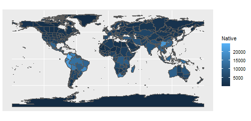
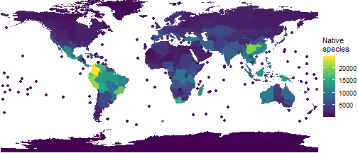
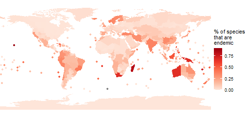
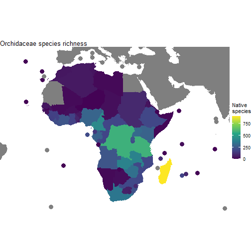

<!-- GENERATED BY vignettes/articles/precompile.R -->

---
title: "Mapping diversity with rWCVP"
author: "Matilda Brown"
date: "26/05/2022"
---


The [World Checklist of Vascular Plants (WCVP)](https://wcvp.science.kew.org) provides distribution data for the > 340,000 vascular plant species known to science. We can use this data to map various metrics of vascular plant biodiversity.

As well as `rWCVP`, we'll use the `tidyverse` packages for data manipulation, the `sf` package for handling spatial data, and the `gt` package for formatting tables.


```r
library(rWCVP)
library(tidyverse)
library(sf)
library(gt)
```

In this example we use the pipe operator (`%>%`),`dplyr` and `ggplot` - if these are unfamiliar we'd suggest checking out https://tidyverse.org/ and some of the help pages therein, or this code might be difficult to interpret. 

Now, let's get started! 

## Species richness

The obvious place to start is global species richness. We can use `wcvp_summary` to condense the global occurrence data for all species into raw counts per WGSRPD Level 3 Area. 

This gives us a list, with information in the first five slots and the data in the slot named `$Summary`. It's this `$Summary` data frame that we'll be working with. 


```r
global_summary <- wcvp_summary()
#> i No area specified. Generating global summary.
#> i No taxon specified. Generating summary of all species.
glimpse(global_summary)
#> List of 6
#>  $ Taxon                               : NULL
#>  $ Area                                : chr "the world"
#>  $ Grouping_variable                   : chr "area_code_l3"
#>  $ Total_number_of_species             : int 347525
#>  $ Number_of_regionally_endemic_species: int 347527
#>  $ Summary                             : tibble [368 x 6] (S3: tbl_df/tbl/data.frame)
#>   ..$ area_code_l3: chr [1:368] "ABT" "AFG" "AGE" "AGS" ...
#>   ..$ Native      : int [1:368] 1608 4510 5331 2082 5357 2990 3382 198 3506 2578 ...
#>   ..$ Endemic     : int [1:368] 0 862 241 252 852 30 60 19 178 75 ...
#>   ..$ Introduced  : int [1:368] 300 101 711 412 404 928 182 48 345 101 ...
#>   ..$ Extinct     : int [1:368] 0 1 1 2 7 2 2 0 30 0 ...
#>   ..$ Total       : int [1:368] 1908 4618 6045 2497 5769 3921 3602 246 3934 2680 ...
```

We could display this using `wcvp_summary_gt` but that's going to be a big table, so let's skip straight to plotting. 

`rWCVPdata` includes the area polygons for the WGSRPD Level 3 Areas - this is going to be the base that we add things to. Let's add the `global_summary` to the spatial data, and plot a map where species richness defines colour. 


```r
#load the spatial data
area_polygons <- rWCVPdata::wgsrpd3 %>% 
  #add the summary data, allowing for the different column names
  left_join(global_summary$Summary, by=c("LEVEL3_COD"="area_code_l3"))

ggplot(area_polygons)+
  geom_sf(aes(fill=Native))
```



Hmm, it's not as pretty as it could be and we're losing all the islands - let's make a few tweaks.


```r
#wrapping n brackets so it assigns as well as prints
(p_native_richness <- ggplot(area_polygons) +
  #remove borders
  geom_sf(aes(fill=Native), col="transparent") +
  # add points for islands
  stat_sf_coordinates(aes(col=Native))+
  #remove borders
  theme_void() +
  #use a better colour palette
  scale_fill_viridis_c(name = "Native\nspecies")+ 
  scale_colour_viridis_c(name = "Native\nspecies")+ 
  #remove extra whitespace
  coord_sf(expand=FALSE)
)
```



Much better! 

## Endemic species richness

We can also incorporate other metrics - let's look at the proportion of species in each Level 3 Area that are endemic to that Area. We'll use a slightly different colour palette too, just for fun. 


```r
area_polygons <- area_polygons %>% 
  mutate(percent_endemic = Endemic/Native)

(p_prop_endemic <- ggplot(area_polygons) +
  #remove borders
  geom_sf(aes(fill=percent_endemic), col="transparent") +
  # add points for islands
  stat_sf_coordinates(aes(col=percent_endemic))+
  #remove borders
  theme_void()+
  #use a better colour palette
  scale_fill_distiller(palette="Reds", direction=1, name="% of species\nthat are\nendemic")+ 
  scale_colour_distiller(palette="Reds", direction=1, 
                         name="% of species\nthat are\nendemic")+ 
  #remove extra whitespace
  coord_sf(expand=FALSE)
)
```



Endemism hotspots really jump out! We can use this information to produce a table of the top ten.


```r
area_polygons %>% 
  #get the region and continent names
  left_join(wgsrpd_mapping) %>% 
  #get the top 10
  slice_max(percent_endemic,n=10) %>% 
  #drop the spatial data
  st_drop_geometry() %>% 
  select(LEVEL3_NAM, percent_endemic, LEVEL1_NAM) %>% 
  group_by(LEVEL1_NAM) %>% 
  #format as a table
  gt() %>% 
  cols_label(
    percent_endemic = "% Endemic",
    LEVEL3_NAM = "WGSRPD Level 3 Area"
  ) %>% 
  tab_options(
    # some nice formatting
        column_labels.font.weight = "bold",
        row_group.font.weight = "bold",
        row_group.as_column = TRUE,
        data_row.padding = px(1),
        table.font.size = 12,
        table_body.hlines.color = "transparent",
        ) %>%
  #format the number as %
  fmt_percent(
    columns = percent_endemic,
    decimals = 1
  )
#> Joining, by = c("LEVEL3_NAM", "LEVEL3_COD", "LEVEL2_COD", "LEVEL1_COD")
```

<!--html_preserve--><div id="zvuypkrofl" style="overflow-x:auto;overflow-y:auto;width:auto;height:auto;">
<style>html {
  font-family: -apple-system, BlinkMacSystemFont, 'Segoe UI', Roboto, Oxygen, Ubuntu, Cantarell, 'Helvetica Neue', 'Fira Sans', 'Droid Sans', Arial, sans-serif;
}

#zvuypkrofl .gt_table {
  display: table;
  border-collapse: collapse;
  margin-left: auto;
  margin-right: auto;
  color: #333333;
  font-size: 12px;
  font-weight: normal;
  font-style: normal;
  background-color: #FFFFFF;
  width: auto;
  border-top-style: solid;
  border-top-width: 2px;
  border-top-color: #A8A8A8;
  border-right-style: none;
  border-right-width: 2px;
  border-right-color: #D3D3D3;
  border-bottom-style: solid;
  border-bottom-width: 2px;
  border-bottom-color: #A8A8A8;
  border-left-style: none;
  border-left-width: 2px;
  border-left-color: #D3D3D3;
}

#zvuypkrofl .gt_heading {
  background-color: #FFFFFF;
  text-align: center;
  border-bottom-color: #FFFFFF;
  border-left-style: none;
  border-left-width: 1px;
  border-left-color: #D3D3D3;
  border-right-style: none;
  border-right-width: 1px;
  border-right-color: #D3D3D3;
}

#zvuypkrofl .gt_title {
  color: #333333;
  font-size: 125%;
  font-weight: initial;
  padding-top: 4px;
  padding-bottom: 4px;
  padding-left: 5px;
  padding-right: 5px;
  border-bottom-color: #FFFFFF;
  border-bottom-width: 0;
}

#zvuypkrofl .gt_subtitle {
  color: #333333;
  font-size: 85%;
  font-weight: initial;
  padding-top: 0;
  padding-bottom: 6px;
  padding-left: 5px;
  padding-right: 5px;
  border-top-color: #FFFFFF;
  border-top-width: 0;
}

#zvuypkrofl .gt_bottom_border {
  border-bottom-style: solid;
  border-bottom-width: 2px;
  border-bottom-color: #D3D3D3;
}

#zvuypkrofl .gt_col_headings {
  border-top-style: solid;
  border-top-width: 2px;
  border-top-color: #D3D3D3;
  border-bottom-style: solid;
  border-bottom-width: 2px;
  border-bottom-color: #D3D3D3;
  border-left-style: none;
  border-left-width: 1px;
  border-left-color: #D3D3D3;
  border-right-style: none;
  border-right-width: 1px;
  border-right-color: #D3D3D3;
}

#zvuypkrofl .gt_col_heading {
  color: #333333;
  background-color: #FFFFFF;
  font-size: 100%;
  font-weight: bold;
  text-transform: inherit;
  border-left-style: none;
  border-left-width: 1px;
  border-left-color: #D3D3D3;
  border-right-style: none;
  border-right-width: 1px;
  border-right-color: #D3D3D3;
  vertical-align: bottom;
  padding-top: 5px;
  padding-bottom: 6px;
  padding-left: 5px;
  padding-right: 5px;
  overflow-x: hidden;
}

#zvuypkrofl .gt_column_spanner_outer {
  color: #333333;
  background-color: #FFFFFF;
  font-size: 100%;
  font-weight: bold;
  text-transform: inherit;
  padding-top: 0;
  padding-bottom: 0;
  padding-left: 4px;
  padding-right: 4px;
}

#zvuypkrofl .gt_column_spanner_outer:first-child {
  padding-left: 0;
}

#zvuypkrofl .gt_column_spanner_outer:last-child {
  padding-right: 0;
}

#zvuypkrofl .gt_column_spanner {
  border-bottom-style: solid;
  border-bottom-width: 2px;
  border-bottom-color: #D3D3D3;
  vertical-align: bottom;
  padding-top: 5px;
  padding-bottom: 5px;
  overflow-x: hidden;
  display: inline-block;
  width: 100%;
}

#zvuypkrofl .gt_group_heading {
  padding-top: 8px;
  padding-bottom: 8px;
  padding-left: 5px;
  padding-right: 5px;
  color: #333333;
  background-color: #FFFFFF;
  font-size: 100%;
  font-weight: bold;
  text-transform: inherit;
  border-top-style: solid;
  border-top-width: 2px;
  border-top-color: #D3D3D3;
  border-bottom-style: solid;
  border-bottom-width: 2px;
  border-bottom-color: #D3D3D3;
  border-left-style: none;
  border-left-width: 1px;
  border-left-color: #D3D3D3;
  border-right-style: none;
  border-right-width: 1px;
  border-right-color: #D3D3D3;
  vertical-align: middle;
}

#zvuypkrofl .gt_empty_group_heading {
  padding: 0.5px;
  color: #333333;
  background-color: #FFFFFF;
  font-size: 100%;
  font-weight: bold;
  border-top-style: solid;
  border-top-width: 2px;
  border-top-color: #D3D3D3;
  border-bottom-style: solid;
  border-bottom-width: 2px;
  border-bottom-color: #D3D3D3;
  vertical-align: middle;
}

#zvuypkrofl .gt_from_md > :first-child {
  margin-top: 0;
}

#zvuypkrofl .gt_from_md > :last-child {
  margin-bottom: 0;
}

#zvuypkrofl .gt_row {
  padding-top: 1px;
  padding-bottom: 1px;
  padding-left: 5px;
  padding-right: 5px;
  margin: 10px;
  border-top-style: solid;
  border-top-width: 1px;
  border-top-color: rgba(255, 255, 255, 0);
  border-left-style: none;
  border-left-width: 1px;
  border-left-color: #D3D3D3;
  border-right-style: none;
  border-right-width: 1px;
  border-right-color: #D3D3D3;
  vertical-align: middle;
  overflow-x: hidden;
}

#zvuypkrofl .gt_stub {
  color: #333333;
  background-color: #FFFFFF;
  font-size: 100%;
  font-weight: initial;
  text-transform: inherit;
  border-right-style: solid;
  border-right-width: 2px;
  border-right-color: #D3D3D3;
  padding-left: 5px;
  padding-right: 5px;
}

#zvuypkrofl .gt_stub_row_group {
  color: #333333;
  background-color: #FFFFFF;
  font-size: 100%;
  font-weight: initial;
  text-transform: inherit;
  border-right-style: solid;
  border-right-width: 2px;
  border-right-color: #D3D3D3;
  padding-left: 5px;
  padding-right: 5px;
  vertical-align: top;
}

#zvuypkrofl .gt_row_group_first td {
  border-top-width: 2px;
}

#zvuypkrofl .gt_summary_row {
  color: #333333;
  background-color: #FFFFFF;
  text-transform: inherit;
  padding-top: 8px;
  padding-bottom: 8px;
  padding-left: 5px;
  padding-right: 5px;
}

#zvuypkrofl .gt_first_summary_row {
  border-top-style: solid;
  border-top-color: #D3D3D3;
}

#zvuypkrofl .gt_first_summary_row.thick {
  border-top-width: 2px;
}

#zvuypkrofl .gt_last_summary_row {
  padding-top: 8px;
  padding-bottom: 8px;
  padding-left: 5px;
  padding-right: 5px;
  border-bottom-style: solid;
  border-bottom-width: 2px;
  border-bottom-color: #D3D3D3;
}

#zvuypkrofl .gt_grand_summary_row {
  color: #333333;
  background-color: #FFFFFF;
  text-transform: inherit;
  padding-top: 8px;
  padding-bottom: 8px;
  padding-left: 5px;
  padding-right: 5px;
}

#zvuypkrofl .gt_first_grand_summary_row {
  padding-top: 8px;
  padding-bottom: 8px;
  padding-left: 5px;
  padding-right: 5px;
  border-top-style: double;
  border-top-width: 6px;
  border-top-color: #D3D3D3;
}

#zvuypkrofl .gt_striped {
  background-color: rgba(128, 128, 128, 0.05);
}

#zvuypkrofl .gt_table_body {
  border-top-style: solid;
  border-top-width: 2px;
  border-top-color: #D3D3D3;
  border-bottom-style: solid;
  border-bottom-width: 2px;
  border-bottom-color: #D3D3D3;
}

#zvuypkrofl .gt_footnotes {
  color: #333333;
  background-color: #FFFFFF;
  border-bottom-style: none;
  border-bottom-width: 2px;
  border-bottom-color: #D3D3D3;
  border-left-style: none;
  border-left-width: 2px;
  border-left-color: #D3D3D3;
  border-right-style: none;
  border-right-width: 2px;
  border-right-color: #D3D3D3;
}

#zvuypkrofl .gt_footnote {
  margin: 0px;
  font-size: 90%;
  padding-left: 4px;
  padding-right: 4px;
  padding-left: 5px;
  padding-right: 5px;
}

#zvuypkrofl .gt_sourcenotes {
  color: #333333;
  background-color: #FFFFFF;
  border-bottom-style: none;
  border-bottom-width: 2px;
  border-bottom-color: #D3D3D3;
  border-left-style: none;
  border-left-width: 2px;
  border-left-color: #D3D3D3;
  border-right-style: none;
  border-right-width: 2px;
  border-right-color: #D3D3D3;
}

#zvuypkrofl .gt_sourcenote {
  font-size: 90%;
  padding-top: 4px;
  padding-bottom: 4px;
  padding-left: 5px;
  padding-right: 5px;
}

#zvuypkrofl .gt_left {
  text-align: left;
}

#zvuypkrofl .gt_center {
  text-align: center;
}

#zvuypkrofl .gt_right {
  text-align: right;
  font-variant-numeric: tabular-nums;
}

#zvuypkrofl .gt_font_normal {
  font-weight: normal;
}

#zvuypkrofl .gt_font_bold {
  font-weight: bold;
}

#zvuypkrofl .gt_font_italic {
  font-style: italic;
}

#zvuypkrofl .gt_super {
  font-size: 65%;
}

#zvuypkrofl .gt_two_val_uncert {
  display: inline-block;
  line-height: 1em;
  text-align: right;
  font-size: 60%;
  vertical-align: -0.25em;
  margin-left: 0.1em;
}

#zvuypkrofl .gt_footnote_marks {
  font-style: italic;
  font-weight: normal;
  font-size: 75%;
  vertical-align: 0.4em;
}

#zvuypkrofl .gt_asterisk {
  font-size: 100%;
  vertical-align: 0;
}

#zvuypkrofl .gt_slash_mark {
  font-size: 0.7em;
  line-height: 0.7em;
  vertical-align: 0.15em;
}

#zvuypkrofl .gt_fraction_numerator {
  font-size: 0.6em;
  line-height: 0.6em;
  vertical-align: 0.45em;
}

#zvuypkrofl .gt_fraction_denominator {
  font-size: 0.6em;
  line-height: 0.6em;
  vertical-align: -0.05em;
}
</style>
<table class="gt_table">
  <thead class="gt_col_headings">
    <tr>
      <th class="gt_col_heading gt_columns_bottom_border gt_left" rowspan="1" colspan="1"></th>
      <th class="gt_col_heading gt_columns_bottom_border gt_left" rowspan="1" colspan="1">WGSRPD Level 3 Area</th>
      <th class="gt_col_heading gt_columns_bottom_border gt_right" rowspan="1" colspan="1">% Endemic</th>
    </tr>
  </thead>
  <tbody class="gt_table_body">
    <tr class="gt_row_group_first"><td rowspan="2" class="gt_row gt_right gt_stub_row_group">PACIFIC</td>
<td class="gt_row gt_left">Hawaii</td>
<td class="gt_row gt_right">91.7%</td></tr>
    <tr><td class="gt_row gt_left">New Caledonia</td>
<td class="gt_row gt_right">76.8%</td></tr>
    <tr class="gt_row_group_first"><td rowspan="3" class="gt_row gt_right gt_stub_row_group">AFRICA</td>
<td class="gt_row gt_left">Madagascar</td>
<td class="gt_row gt_right">82.1%</td></tr>
    <tr><td class="gt_row gt_left">Cape Provinces</td>
<td class="gt_row gt_right">67.7%</td></tr>
    <tr><td class="gt_row gt_left">St.Helena</td>
<td class="gt_row gt_right">61.7%</td></tr>
    <tr class="gt_row_group_first"><td rowspan="3" class="gt_row gt_right gt_stub_row_group">ASIA-TROPICAL</td>
<td class="gt_row gt_left">New Guinea</td>
<td class="gt_row gt_right">67.8%</td></tr>
    <tr><td class="gt_row gt_left">Borneo</td>
<td class="gt_row gt_right">52.8%</td></tr>
    <tr><td class="gt_row gt_left">Philippines</td>
<td class="gt_row gt_right">52.1%</td></tr>
    <tr class="gt_row_group_first"><td rowspan="1" class="gt_row gt_right gt_stub_row_group">AUSTRALASIA</td>
<td class="gt_row gt_left">Western Australia</td>
<td class="gt_row gt_right">67.2%</td></tr>
    <tr class="gt_row_group_first"><td rowspan="1" class="gt_row gt_right gt_stub_row_group">SOUTHERN AMERICA</td>
<td class="gt_row gt_left">Juan Fernández Is.</td>
<td class="gt_row gt_right">51.0%</td></tr>
  </tbody>
</table>
</div><!--/html_preserve-->

We can attach any variable to `area_polygons` - it doesn't have to be from the World Checklist! 

## Limiting maps to an area of interest

One more example, showing how we can limit our maps to a specific area of interest. Let's look at orchids in Africa. 


```r
orchid_africa_summary <- wcvp_summary("Orchidaceae", "family", get_wgsrpd3_codes("Africa"))
#> i Matches to input geography found at Continent (Level 1)
```

Remember that the dataset is saved in the `$Summary` slot (trying to join `orchid_africa_summary` will cause an error). 


```r
#reset the spatial data by loading it in afresh
area_polygons <- rWCVPdata::wgsrpd3 %>% 
  #add the summary data, allowing for the different column names
  left_join(orchid_africa_summary$Summary, by=c("LEVEL3_COD"="area_code_l3")) %>% 
  #add continent and region names for easy filtering
  left_join(wgsrpd_mapping) 
#> Joining, by = c("LEVEL3_NAM", "LEVEL3_COD", "LEVEL2_COD", "LEVEL1_COD")
```

We could filter our polygons to only those in Africa, but from a mapping perspective it makes more sense to leave them in (though greyed out). So, to constrain our map, we need to set up custom limits. 


```r
#get a sensible bounding box for the polygons in Africa
bounding_box <- st_bbox(area_polygons %>% filter(LEVEL1_NAM =="AFRICA"))
#add a buffer as we set limits
xmin <- bounding_box["xmin"] - 2
xmax <- bounding_box["xmax"] + 2
ymin <- bounding_box["ymin"] - 2
ymax <- bounding_box["ymax"] + 2

(p_orchids <- ggplot(area_polygons) +
  #remove borders
  geom_sf(aes(fill=Native), col="transparent") +
  # add points for islands
  stat_sf_coordinates(aes(col=Native), size=4)+
  #bounding box we set up above
  coord_sf(xlim=c(xmin, xmax), ylim=c(ymin, ymax))+
  #remove borders
  theme_void()+
  #set colour palette (fill for polygons, colour for points)
  scale_fill_viridis_c(name = "Native\nspecies")+ 
  scale_colour_viridis_c(name = "Native\nspecies")+
    ggtitle("Orchidaceae species richness")
)
```


