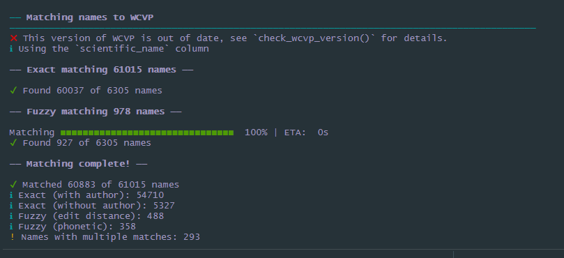
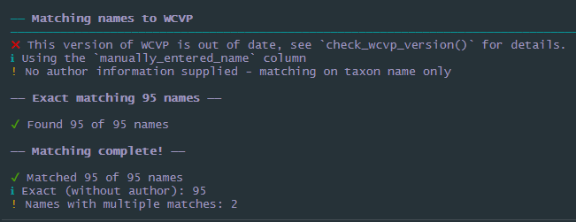

```{r, include = FALSE}
knitr::opts_chunk$set(
  collapse = TRUE,
  comment = "#>"
)
```

## Example dataset: the IUCN Red List
```{r}
library(tidyverse)
library(rWCVP)
library(gt)

redlist <- read_csv("rl_assessment_details_20220725_version2022-1.csv")

redlist <- redlist %>% 
  filter(phylum ==  "TRACHEOPHYTA") %>% #filter out the bryophytes
  select(scientific_name, authority, category)
glimpse(redlist)
```
```{r cache=TRUE, message=FALSE }
#m1 for matching step 1
redlist_m1 <- match_names(redlist,
                          name_col = "scientific_name",
                          author_col = "authority",
                          fuzzy = TRUE)
```
{width=100%}

We get a warning about rWCVP being out of date - this is because the package (and therefore this tutorial) have been developed using a version of the data that is not currently on the website, so we can ignore it for now. 

We also get a series of messages, giving us an idea of the proportion that were exact matched, and how long we can expect fuzzy matching to take. 

Once it's finished, we get a full summary. We need to resolve fuzzy and multiple matches

There are not too many fuzzy matches (around 1000) but still a lot to manually verify, so let's do a bit of pre-checking based on the following rules:

1. We want to manually verify anything that is <90% similar. 
2. If the fuzzy match has an identical author string and is ≥90% similar, we keep it. 
3. If the fuzzy match is only one letter out (i.e. has an edit distance of 1) and is ≥90% similar, we keep it. 

Let's apply these:
```{r}
# f for fuzzy
redlist_f <- redlist_m1 %>% 
  filter(match_type %in% c("Fuzzy (phonetic)", 
                           "Fuzzy (edit distance)")) %>% 
  mutate(
    keep = case_when( #set up a keep column
      match_similarity<0.9 ~ NA_real_, # fill with blank for dissimilar names
      wcvp_author_edit_distance==0 ~ 1, # fill with 1 if authors identical
      match_edit_distance==1 ~ 1, # fill with 1 if only one letter different
      TRUE ~ NA_real_ # otherwise leave blank
     )
  ) 

#how many did this resolve? 
table(redlist_f$keep, useNA = "always")
  
```
A great start! Over half of all fuzzy matches can be resolved without looking at them. 

What about an edit distance of 2 - surely that's still pretty close?  

```{r}
redlist_f %>% 
  filter(match_edit_distance==2, 
         multiple_matches==FALSE, 
         match_similarity>0.9
         ) %>% 
  arrange(desc(wcvp_author_edit_distance)) %>% #sort by least similar authors first
  select(scientific_name, authority, 
         match_type, 
         wcvp_name, wcvp_authors
         ) %>% 
  head()
  
```
Hmm, clearly not! 

If we really wanted to continue algorithmically, we could take a random sample of 100 names and test out how accurate various rules are - for an example using similarity, see the Supporting Information in [Nic Lughadha et al. (2020)](https://doi.org/10.1002/ppp3.10146). 

However, at this point, a quick glance at each name is going to give the most accurate result and be faster. 

```{r eval=FALSE}
write.csv(redlist_f, "redlist_fuzzy_tocheck.csv", fileEncoding = "UTF-8" ,row.names = FALSE)
  
```
It took under an hour to eyeball these in Excel; I marked good matches with a 1 in the `keep` column, and bad matches with a 0. Then, I deleted all the match data except `match_type` and `multiple.matches` for the bad matches, and added a new column `resolved_match_type`. I left this blank for the good matches, and filled it with "Fuzzy match rejected" for the bad matches. 

Now, we read that file back in:

```{r}
redlist_f2 <- read.csv("extdata/redlist-fuzzy-checked.csv") %>% 
  select(-keep) %>% 
  mutate(resolved_match_type = case_when(
    !is.na(resolved_match_type) & resolved_match_type != "" ~ resolved_match_type,
    TRUE ~ match_type
  ))


# r for resolved
redlist_r1 <- redlist_m1 %>% 
  filter(!match_type %in% c("Fuzzy (phonetic)", "Fuzzy (edit distance)")) %>% 
  bind_rows(redlist_f2)
```

Still the same number of rows - we don't want to get rid of the bad matches (yet). 

Now we need to deal with the multiple matches. Again, we can use some rules:

1. Filter matches using author information. If one or more matches has the same author string, we keep 
2. If one (and only one) of the matches is Accepted, we keep that one. 
3. If one (and only one) of the matches is a Synonym (as opposed to Invalid, Illegitimate, etc), we keep that one 

We can set this up in a function: 
```{r}
# resolve multiple matches function ####
resolve_multi <- function(x){
  summ <- x %>% summarise(
    n.Auth = length(which(.$wcvp_author_edit_distance ==0)),
    n.Acc = length(which(.$wcvp_status=="Accepted")),
    n.syn = length(which(.$wcvp_status %in% c("Synonym", "Orthographic","Artificial Hybrid","Unplaced"))),
    n.hom = length(which(.$wcvp_homotypic==1)),
    n.sameacc = length(unique(.$wcvp_accepted_id))/nrow(.)
  )
  
  if(summ$n.Auth > 0) x <- x %>% filter(wcvp_author_edit_distance ==0)
  if (nrow(x) ==1) return(x)
  if(summ$n.Acc==1) x <- x %>% filter(wcvp_status=="Accepted") 
  if (nrow(x) ==1) return(x)
  if(summ$n.syn==1) x <- x %>% filter(wcvp_status %in% c("Synonym", "Orthographic","Artificial Hybrid","Unplaced")) 
  if (nrow(x) ==1) return(x)
  if(summ$n.sameacc==1) x <- x[1,]
  if(nrow(x)>1) {
    x <- x[1,]
    x[,(ncol(x)-10):ncol(x)] <- NA
    x$resolved_match_type <- "Could not resolve multiple matches"
  }
  return(x)
}
```

Now we go through each name that has multiple matches and apply these rules: 

```{r}


# m for multi this time

redlist_m2 <- redlist_r1 %>% filter(multiple_matches==TRUE) %>% 
  group_by(scientific_name) %>% 
  group_split()

for (i in 1:length(redlist_m2)){
  redlist_m2[[i]] <- resolve_multi(redlist_m2[[i]])
}
  
redlist_m2 <- do.call(bind_rows, redlist_m2) %>% 
   mutate(resolved_match_type = case_when(
   !is.na(resolved_match_type) & resolved_match_type != "" ~ resolved_match_type,
    TRUE ~ match_type
  ))

 
redlist_r2 <- redlist_r1 %>% filter(multiple_matches==FALSE | is.na(multiple_matches)) %>% 
  rbind(redlist_m2) %>% 
  mutate(resolved_match_type = case_when(
   !is.na(resolved_match_type) & resolved_match_type != "" ~ resolved_match_type,
    TRUE ~ match_type
  ))
```


What's our resolved summary? 
```{r}
redlist_r2$resolved_match_type[which(is.na(redlist_r2$resolved_match_type))] <- "No match found" 
table(redlist_r2$resolved_match_type)

```
Hmm, still just under names (around 1% of the original dataset) that we couldn't find a match for. For most datasets, this is an acceptable loss, but this particular data will be used for several papers, so it's worth going through more carefully.


```{r eval=FALSE}
write.csv(redlist_r2 %>% 
            filter(resolved_match_type %in% c("No match found",
                                              "Fuzzy match rejected")
                   ),
          "redlist_tomanuallymatch.csv", row.names = F
          )
```

Here's one we prepared earlier: 

```{r}
#m for manual, this time
redlist_m3 <- read.csv("extdata/redlist-manually-matched.csv")
table(redlist_m3$resolved_match_type)
```

In this example, many of the unmatched names are new species that have not been added to the WCVP (sometimes listed as e.g. *Heptapleurum* sp.), making it quicker than searching every name individually. Still, it's a time consuming process with a relatively small success rate (here, we found names for 95), so it will not be applicable to all (or even most) name-matching workflows. 

We need to re-run matching on the manually matched names, to get the rest of the info: 


```{r message=FALSE}
redlist_m4 <- rWCVP::match_names(redlist_m3 %>% 
                                   filter(manually_entered_name!=""), 
                                 name_col = "manually_entered_name", 
                                 fuzzy=FALSE)
```
{width=100%}

Oop, a couple multiple names here - let's resolve them and tidy up the columns: 

```{r}
redlist_m4 <- redlist_m4 %>% group_by(scientific_name) %>% group_split()
for (i in 1:length(redlist_m4)){
  if(nrow(redlist_m4[[i]])>1) # only multiple matches
    # OK to ignore the warnings
  redlist_m4[[i]] <- resolve_multi(redlist_m4[[i]])
}

redlist_m4 <- do.call(rbind, redlist_m4) 

redlist_m3 <- bind_rows(redlist_m3 %>% 
                          filter(resolved_match_type!= "Manually matched"), 
                        redlist_m4) %>%
  select(-c(manually_entered_name, Notes, match_type, multiple_matches, match_similarity, match_edit_distance)) %>% 
  rename(match_type=original_match_type) 

redlist_r3 <- bind_rows(redlist_r2 %>% filter(!resolved_match_type %in% c("No match found",
                                              "Fuzzy match rejected")), redlist_m3)
```

```{r}

table(redlist_r3$resolved_match_type) %>% as.data.frame() %>% 
  arrange(desc(Freq)) %>% 
   gt(rowname_col = "Var1") %>% 
  tab_options(table_body.hlines.color = "transparent",
              column_labels.hidden = TRUE) %>% 
  summary_rows(
    columns = c(Freq),
    fns = list(Total ="sum"),
    formatter = fmt_integer
  ) %>% 
  tab_style(
    style = list(
      cell_text(align = "left")
    ),
    locations = cells_stub()
  ) %>%
  tab_header("Match summary", "(after resolution of fuzzy and multiple matches)") %>% 
   opt_align_table_header(align = "left")
```

Great! We might also want to visualise this, but first, let's finish the resolution - what we want is to link each Red List assessment to an Accepted species name. This is where things get a little tricky - for synonyms, we need to consider how the name change affects the assessment. Specifically, we can only apply the new name to the assessment if the taxonomic concept has been preserved: 

{width=50%}

Luckily, we can use the `homotypic_synonym` column of the WCVP to easily filter our matches. 

We'll add the full WCVP to our data, using `wcvp_accepted_id` to join with `plant_name_id`. 

```{r}
# a for accepted
redlist_a1 <- redlist_r3 %>% left_join(rWCVPdata::wcvp_names, by=c("wcvp_accepted_id"="plant_name_id")) %>% 
  mutate(keep = case_when(
    wcvp_status == "Accepted" | wcvp_homotypic ==TRUE ~ "Matched to an accepted name",
    TRUE ~ "Not matched to an accepted name"
  ))

table(redlist_a1$keep)
```
Still the vast majority! 

We can filter this dataset to only assessments that have been matched to an accepted name, but first, let's visualise the proportion of names at each step. We can do this using an alluvial plot:

```{r}
library(ggalluvial)

p <- redlist_a1  %>% 
  mutate(
    step0 = "Input",
    step1 = case_when(
      match_type == "Exact (with author)" ~ "Exact",
      match_type == "Exact (without author)" ~ "Exact",
      match_type %in% c("Fuzzy (edit distance)","Fuzzy (phonetic)") ~ "Fuzzy",
      match_type == "No match found" ~ "No match"),
    step2 = case_when(
      resolved_match_type == "Exact (without author)" ~ sprintf("\U2713"),
      resolved_match_type == "Exact (with author)" ~ sprintf("\U2713"),
      resolved_match_type == "Fuzzy (edit distance)" ~ sprintf("\U2713"),
      resolved_match_type == "Fuzzy (phonetic)" ~ sprintf("\U2713"),
      resolved_match_type == "Could not resolve multiple matches" ~ sprintf("\U2716"),
      resolved_match_type == "Fuzzy match rejected" ~ sprintf("\U2716"),
      resolved_match_type == "No match found" ~ sprintf("\U2716")),
    step3 = 
      case_when (
        keep == "Matched to an accepted name" ~ sprintf("\U2713"),
        TRUE ~ sprintf("\U2716")
  ) )%>% 
  mutate(scenario =paste0(step1,multiple_matches,step2, step3)) %>% 
  group_by(step0, step1, step2,step3,scenario) %>% summarise(n=n()) %>% 
  mutate(colour_key = step3) %>% 
  to_lodes_form(axes=c(1:4), id = "scenario") %>% 
  ggplot(aes(x=x, y=n, stratum=stratum, alluvium=scenario, fill=colour_key)) +
  scale_fill_brewer(type = "qual", palette = "Set2") +
  geom_flow(stat = "alluvium", lode.guidance = "frontback",
            color = "darkgray",aes.flow = "forward") +
  geom_stratum() +
  theme_void()+
  ggrepel::geom_text_repel(
    aes(label = ifelse(as.character(stratum) %in% c("Fuzzy", "No match"), as.character(stratum), NA)),
    stat = "stratum", size = 4, direction = "y", nudge_x = -.5
  ) +
  geom_text(
    aes(label = ifelse(!as.character(stratum) %in% c("Fuzzy", "No match"), as.character(stratum), NA)),
    stat = "stratum", size = 4
  ) +
  theme(legend.position = "none")


p +
  geom_text(label=c("Initial"), x=2, y=61371*1.03)+
  geom_text(label=c("Resolved"), x=3, y=61371*1.03)+
  geom_text(label=c("Accepted"), x=4, y=61371*1.03)

  


```
    
Clearly, the vast majority of the names have exact matches (with and without author string) that needed no resolution. If we exclude them, effectively zooming in on the lower part of that figure, we can see more detail on the less straightforward matches: 

```{r fig.height=8, fig.width=9}

p <- redlist_a1  %>% 
  mutate(
    step1 = gsub("\\(", "\n\\(", match_type),
    step2 = gsub("\\(", "\n\\(", resolved_match_type),
    step3 = 
      case_when (
        keep == "Matched to an accepted name" ~ sprintf("\U2713"),
        TRUE ~ sprintf("\U2716")
        ) 
  )%>% 
  mutate(scenario =paste0(step1,multiple_matches,step2, step3)) %>% 
  group_by(step1, step2,step3,scenario) %>% summarise(n=n()) %>% 
  mutate(colour_key = step3) %>% 
  to_lodes_form(axes=c(1:3), id = "scenario") %>% 
  #filter out the big categories
  filter(n<4000) %>% 
  ggplot(aes(x=x, y=n, stratum=stratum, alluvium=scenario, fill=colour_key)) +
  scale_fill_brewer(type = "qual", palette = "Set2") +
  geom_flow(stat = "alluvium", lode.guidance = "frontback",
            color = "darkgray",aes.flow = "forward") +
  geom_stratum() +
  theme_void()+
  geom_text(
    aes(label = ifelse(as.character(stratum) %in% c(sprintf("\U2713"), 
                                                    sprintf("\U2716")), 
                       as.character(stratum), NA)),
    stat = "stratum", size = 8
  ) +
   geom_text(
    aes(label = ifelse(!as.character(stratum) %in% c(sprintf("\U2713"), 
                                                    sprintf("\U2716")), 
                       as.character(stratum), NA)),
    stat = "stratum", size = 4
  ) +
  # geom_text(
  #   aes(label = ifelse(!as.character(stratum) %in% c("Fuzzy", "No match"), as.character(stratum), NA)),
  #   stat = "stratum", size = 4
  # ) +
  theme(legend.position = "none")


p +
  geom_text(label=c("Initial"), x=1, y=2950, size=5)+
  geom_text(label=c("Resolved"), x=2, y=2950, size=5)+
  geom_text(label=c("Accepted"), x=3, y=2950, size=5)+
  geom_text(label="e.g. heterotypic \nsynonyms, \nunplaced names", x=3.4, y=1000, size=4)
```

Finally, we want to turn our large data.frame into something more manageable that we can use for downstream analyses, by filtering out all of the unsuccessful matches and reducing the number of columns (plus renaming them to be more intuituve): 
```{r}
redlist_a2 <- redlist_a1 %>%
  filter(keep=="Matched to an accepted name") %>% 
  select(1:3, wcvp_name, wcvp_status, wcvp_accepted_id, ipni_id, taxon_name, taxon_authors, taxon_status) %>% 
  rename(match_name=wcvp_name,
         match_status=wcvp_status,
         accepted_plant_name_id = wcvp_accepted_id,
         accepted_taxon_name = taxon_name,
         accepted_taxon_authors = taxon_authors,
         accepted_taxon_status=taxon_status)

glimpse(redlist_a2)

```


