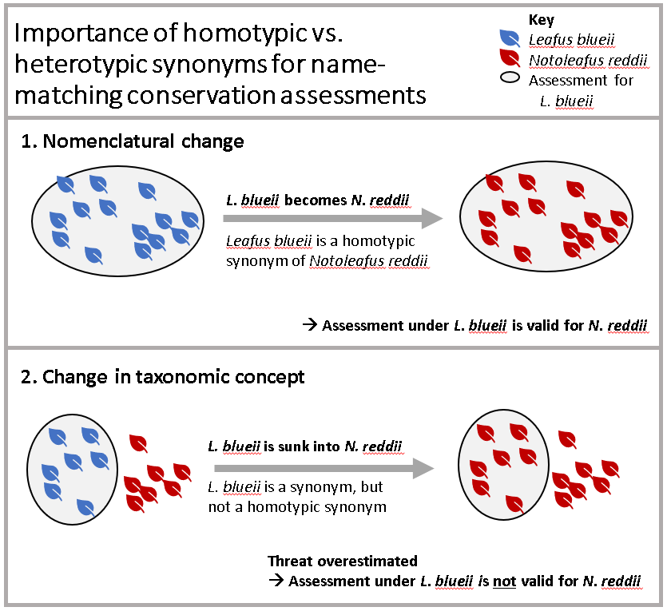

<!-- GENERATED BY vignettes/articles/precompile.R -->


The World Checklist of Vascular Plants provides a global consensus view of all known vascular plant species, including taxonomic status and synonymy. As such, it can be used for standardising and reconciling lists of plant names from other sources.

We have implemented name matching functions in rWCVP to make it simpler for a user to standardise a list of plant names against WCVP.

In this article, we'll show you an example of how name matching in rWCVP might fit into a realistic workflow.

As well as `rWCVP`, we'll be using the `tidyverse` collection of packages for data manipulation, `gt` for formatting tables, and `ggalluvial` for visualising the matching process.


```r
library(tidyverse)
library(rWCVP)
library(gt)
library(ggalluvial)
```

## Example dataset: the IUCN Red List

The example we'll use here is matching assessments from the IUCN Red List of Threatened Species (Red List) to accepted names in the WCVP.

We're using a download of plant assessments from version 2022-1 of the Red List, which we made through [their website](https://www.iucnredlist.org/).


```r
redlist <- read_csv(
  "../../inst/extdata/redlist-summary_2022-1.csv",
  col_types=cols(.default=col_character())
)

glimpse(redlist)
#> Rows: 61,015
#> Columns: 3
#> $ scientific_name <chr> "Cotoneaster granatensis", "Juniperus drupacea", "Picea omorika",~
#> $ authority       <chr> "Boiss.", "Labill.", "(Pancic) Purk.", "Boiss.", "Steud. &amp; Ho~
#> $ category        <chr> "LR/cd", "LC", "EN", "VU", "LC", "EN", "VU", "LC", "EN", "CR", "N~
```

Now that we've loaded the names from the Red List, we can match them to the WCVP using the `wcvp_match_names` function.

This function takes a data frame of names for matching, the name of the column in the data frame storing the names, and (optionally) the name of the column storing the authors for each name, if you want to include that in the matching process.

The function will first try to find any names that match exactly to names in the WCVP. If an author column has been provided, this first step will include authors and a second step will run to match any remaining names exactly without the author strings. All remaining unmatched names are then passed through a fuzzy matching process that tries to match names phonetically and then finds the most similar name by Levenshtein distance.


```r
matches <- wcvp_match_names(redlist,
                       name_col="scientific_name",
                       author_col="authority",
                       fuzzy=TRUE,
                       progress_bar=FALSE)
#> 
#> -- Matching names to WCVP ---------------------------------
#> i Using the `scientific_name` column
#> 
#> -- Exact matching 61015 names --
#> 
#> v Found 60165 of 61015 names
#> 
#> -- Fuzzy matching 850 names --
#> 
#> 
v Found 826 of 850 names


-- Matching complete! --


v Matched 60928 of 61015 names

i Exact (with author): 43268

i Exact (without author): 16897

i Fuzzy (edit distance): 398

i Fuzzy (phonetic): 365

! Names with multiple matches: 391
```

We haven't explicitly passed in a data frame of names from WCVP, and we get a warning because we are using an out of date version via the rWCVPdata package. We can ignore this warning for now because the package (and therefore this tutorial) have been developed using a version of the data that is not currently on the website.

We also get a series of messages, giving us an idea of the proportion that were exact matched, and how long we can expect fuzzy matching to take.

Once it's finished, we get a full summary of how many names were matched, how many used fuzzy matching, and how many were matched to multiple names in the WCVP.

The output of the `wcvp_match_names` is a data frame of our original names, which names they match to in the WCVP, and information on how they were matched and how close any fuzzy matches are.

## Resolving matched names to accepted species

Now we've matched our names, we can resolve the fuzzy matches and the names that were matched to multiple entries in WCVP, and make sure our assessed species are linked to accepted names in WCVP.

How you choose which fuzzy matches are valid and resolve multiple matches will ultimately depend on your reason for doing the matching. For instance, we're matching IUCN assessments to accepted names in WCVP. For this application, an assessment is only valid for a particular taxonomic concept, so we might not care about resolving anything matched to a non-homotypic synonym.

In the case of this tutorial, we've tried to resolve as many fuzzy and multiple matches as possible first, before filtering out matches that aren't appropriate for our application.

### Fuzzy matches

There are not too many fuzzy matches (around 1000) but still a lot to manually verify, so let's do a bit of pre-checking based on the following rules:

1. We want to manually verify anything that is <90% similar.
2. If the fuzzy match has an identical author string and is ≥90% similar, we keep it.
3. If the fuzzy match is only one letter out (i.e. has an edit distance of 1) and is ≥90% similar, we keep it.

Let's apply these.


```r
fuzzy_matches <- matches %>%
  filter(str_detect(match_type, "Fuzzy")) %>%
  mutate(
    keep = case_when( #set up a keep column
      match_similarity < 0.9 ~ NA_real_, # fill with blank for dissimilar names
      wcvp_author_edit_distance == 0 ~ 1, # fill with 1 if authors identical
      match_edit_distance == 1 ~ 1, # fill with 1 if only one letter different
    )
  )

#how many did this resolve?
table(fuzzy_matches$keep, useNA = "always")
#> 
#>    1 <NA> 
#>  534  317
```

A great start! Over half of all fuzzy matches can be resolved without looking at them.

What about an edit distance of 2 - surely that's still pretty close?


```r
fuzzy_matches %>%
  filter(match_edit_distance == 2,
         !multiple_matches,
         match_similarity > 0.9
         ) %>%
  arrange(desc(wcvp_author_edit_distance)) %>% #sort by least similar authors first
  select(scientific_name, authority, match_type,wcvp_name, wcvp_authors) %>%
  head()
#> # A tibble: 6 x 5
#>   scientific_name          authority                           match_type   wcvp_~1 wcvp_~2
#>   <chr>                    <chr>                               <chr>        <chr>   <chr>  
#> 1 Diospyros tampolensis    H.N.Rakouth, G.E.Schatz &amp; Lowry Fuzzy (edit~ Diospy~ H.Perr~
#> 2 Diospyros crassifolia    A.G.Linan, G.E.Schatz &amp; Lowry   Fuzzy (edit~ Diospy~ D.Don  
#> 3 Diospyros nitidifolia    A.G.Linan, G.E.Schatz &amp; Lowry   Fuzzy (edit~ Diospy~ Elmer  
#> 4 Garcinia eugeniaefolia   Wall                                Fuzzy (phon~ Garcin~ (Chois~
#> 5 Hebepetalum humiriifolia (Planch.) Benth.                    Fuzzy (edit~ Hebepe~ (Planc~
#> 6 Diospyros ambanjensis    G.E.Schatz &amp; Lowry              Fuzzy (edit~ Diospy~ Gürke  
#> # ... with abbreviated variable names 1: wcvp_name, 2: wcvp_authors
```
Hmm, clearly not!

If we really wanted to continue algorithmically, we could take a random sample of 100 names and test out how accurate various rules are - for an example using similarity, see the Supporting Information in [Nic Lughadha et al. (2020)](https://doi.org/10.1002/ppp3.10146).

However, at this point, a quick glance at each name is going to give the most accurate result and be faster.


```r
write_csv(fuzzy_matches, "redlist-fuzzy-tocheck.csv")
```

It took under an hour to eyeball these in Excel; I marked good matches with a 1 in the `keep` column, and bad matches with a 0. Then, I deleted all the match data except `match_type` and `multiple_matches` for the bad matches, and added a new column `resolved_match_type`. I left this blank for the good matches, and filled it with "Fuzzy match rejected" for the bad matches.

Now, we read that file back in.


```r
fuzzy_checked <-
  read_csv("../../inst/extdata/redlist-fuzzy-checked.csv",
           show_col_types=FALSE) %>%
  select(-keep) %>%
  mutate(resolved_match_type=ifelse(! is.na(resolved_match_type),
                                    resolved_match_type,
                                    match_type))

checked_matches <- matches %>%
  filter(! str_detect(match_type, "Fuzzy")) %>%
  bind_rows(fuzzy_checked)
```

So far we've kept the same number of rows - we don't want to get rid of the bad matches (yet).

### Multiple matches

Now we need to deal with the multiple matches. Again, we can use some rules to automatically resolve these:

1. Filter matches using author information. If one or more matches has the same author string, we keep them.
2. If one (and only one) of the matches is Accepted, we keep that one.
3. If one (and only one) of the matches is a Synonym (as opposed to Invalid, Illegitimate, etc), we keep that one.

We'll write these rules into a function.


```r
# resolve multiple matches function ####
resolve_multi <- function(df) {
  if (nrow(df) == 1) {
    return(df)
  }

  # some fuzzy matches are rejected from the previous section
  valid_matches <- filter(df, !is.na(match_similarity))

  if (nrow(valid_matches) == 0) {
    return(head(df, 1))
  }

  matching_authors <-
    valid_matches %>%
    filter(wcvp_author_edit_distance == 0 | ! sum(wcvp_author_edit_distance == 0,
                                                  na.rm=TRUE))

  if (nrow(matching_authors) == 1) {
    return(matching_authors)
  }

  accepted_names <-
    matching_authors %>%
    filter(wcvp_status == "Accepted" | ! sum(wcvp_status == "Accepted"))

  if (nrow(accepted_names) == 1) {
    return(accepted_names)
  }

  synonym_codes <- c("Synonym", "Orthographic", "Artificial Hybrid", "Unplaced")
  synonyms <-
    accepted_names %>%
    filter(wcvp_status %in% synonym_codes | ! sum(wcvp_status %in% synonym_codes))

  if (nrow(synonyms) == 1)  {
    return(synonyms)
  }

  n_matches <- length(unique(synonyms$wcvp_accepted_id)) / nrow(synonyms)
  final <- head(synonyms, 1)

  if (n_matches != 1) {
    final <-
      final %>%
      mutate(
        across(wcvp_id:resolved_match_type & where(is.numeric), ~NA_real_),
        across(wcvp_id:resolved_match_type & where(is.character), ~NA_character_),
        resolved_match_type="Could not resolve multiple matches"
      )
  }

  final
}
```

Now we go through each name that has multiple matches and apply these rules.


```r
auto_resolved <-
  checked_matches %>%
  nest_by(scientific_name) %>%
  mutate(data=list(resolve_multi(data))) %>%
  unnest(col=data) %>%
  ungroup()

auto_resolved <-
  auto_resolved %>%
  mutate(resolved_match_type=case_when(
    is.na(resolved_match_type) & is.na(match_type) ~ "No match found",
    is.na(resolved_match_type) ~ match_type,
    TRUE ~ resolved_match_type
  ))
```


How did our automatic resolution do?


```r
count(auto_resolved, resolved_match_type)
#> # A tibble: 6 x 2
#>   resolved_match_type                    n
#>   <chr>                              <int>
#> 1 Could not resolve multiple matches     6
#> 2 Exact (with author)                43266
#> 3 Exact (without author)             16893
#> 4 Fuzzy (edit distance)                323
#> 5 Fuzzy (phonetic)                     350
#> 6 Fuzzy match rejected                  90
```

Hmm, still ~90 names (less than 1% of the original dataset) that we couldn't find a match for. For most datasets, this is an acceptable loss, but this particular data will be used for several papers, so it's worth going through more carefully.


```r
auto_resolved %>%
  filter(resolved_match_type %in% c("No match found","Fuzzy match rejected")) %>%
  write_csv("redlist_tomanuallymatch.csv")
```

Here's one we prepared earlier.


```r
manually_resolved <- read_csv("../../inst/extdata/redlist-manually-matched.csv",
                              show_col_types=FALSE)
count(manually_resolved, resolved_match_type)
#> # A tibble: 3 x 2
#>   resolved_match_type         n
#>   <chr>                   <int>
#> 1 Manually matched           14
#> 2 New/undescribed species    55
#> 3 No valid match found       21
```

In this example, many of the unmatched names are new species that have not been added to the WCVP (sometimes listed as e.g. *Heptapleurum* sp.), making it quicker than searching every name individually. Still, it's a time consuming process with a relatively small success rate (here, we found names for 95), so it will not be applicable to all (or even most) name-matching workflows.

We need to re-run matching on the manually matched names, to get the rest of the info.


```r
manually_resolved <-
  manually_resolved %>%
  wcvp_match_names(name_col = "manually_entered_name", fuzzy=FALSE)
#> 
#> -- Matching names to WCVP -----------------------------------------------------------------
#> i Using the `manually_entered_name` column
#> ! No author information supplied - matching on taxon name only
#> 
#> -- Exact matching  names --
#> 
#> v Found 13 of  names
#> 
#> -- Matching complete! --
#> 
#> v Matched 13 of 15 names
#> i Exact (without author): 13
#> i No match found: 2
#> ! Names with multiple matches: 0
```

This has produced a couple of multiple matches again. We could have avoided this by entering the WCVP ID that we wanted rather than the name. But in this case, it only affects a couple of records. Looking at these, the extra names are illegitimate, so we can just quickly filter these out.


```r
manually_resolved <- filter(manually_resolved, wcvp_status != "Illegitimate")
```

And now we'll insert them back into our match results and remove anything that remains unmatched.


```r
resolved_matches <-
  manually_resolved %>%
  select(-c(manually_entered_name, Notes, match_type, multiple_matches,
            match_similarity, match_edit_distance)) %>%
  rename(match_type=original_match_type) %>%
  bind_rows(
    auto_resolved %>%
    filter(! scientific_name %in% manually_resolved$scientific_name)
  )
```

Finally, we'll take a look at a summary of our name resolution in a nicely formatted table.


```r
resolved_matches %>%
  count(resolved_match_type, sort=TRUE) %>%
  gt(rowname_col = "resolved_match_type") %>%
  tab_options(table_body.hlines.color = "transparent",
              column_labels.hidden = TRUE) %>%
  summary_rows(
    columns = c(n),
    fns = list(Total ="sum"),
    formatter = fmt_integer
  ) %>%
  tab_style(
    style = list(
      cell_text(align = "left")
    ),
    locations = cells_stub()
  ) %>%
  tab_header("Match summary", "(after resolution of fuzzy and multiple matches)") %>%
  opt_align_table_header(align = "left")
```

<!--html_preserve--><div id="ykzcnvzeht" style="overflow-x:auto;overflow-y:auto;width:auto;height:auto;">
<style>html {
  font-family: -apple-system, BlinkMacSystemFont, 'Segoe UI', Roboto, Oxygen, Ubuntu, Cantarell, 'Helvetica Neue', 'Fira Sans', 'Droid Sans', Arial, sans-serif;
}

#ykzcnvzeht .gt_table {
  display: table;
  border-collapse: collapse;
  margin-left: auto;
  margin-right: auto;
  color: #333333;
  font-size: 16px;
  font-weight: normal;
  font-style: normal;
  background-color: #FFFFFF;
  width: auto;
  border-top-style: solid;
  border-top-width: 2px;
  border-top-color: #A8A8A8;
  border-right-style: none;
  border-right-width: 2px;
  border-right-color: #D3D3D3;
  border-bottom-style: solid;
  border-bottom-width: 2px;
  border-bottom-color: #A8A8A8;
  border-left-style: none;
  border-left-width: 2px;
  border-left-color: #D3D3D3;
}

#ykzcnvzeht .gt_heading {
  background-color: #FFFFFF;
  text-align: left;
  border-bottom-color: #FFFFFF;
  border-left-style: none;
  border-left-width: 1px;
  border-left-color: #D3D3D3;
  border-right-style: none;
  border-right-width: 1px;
  border-right-color: #D3D3D3;
}

#ykzcnvzeht .gt_title {
  color: #333333;
  font-size: 125%;
  font-weight: initial;
  padding-top: 4px;
  padding-bottom: 4px;
  padding-left: 5px;
  padding-right: 5px;
  border-bottom-color: #FFFFFF;
  border-bottom-width: 0;
}

#ykzcnvzeht .gt_subtitle {
  color: #333333;
  font-size: 85%;
  font-weight: initial;
  padding-top: 0;
  padding-bottom: 6px;
  padding-left: 5px;
  padding-right: 5px;
  border-top-color: #FFFFFF;
  border-top-width: 0;
}

#ykzcnvzeht .gt_bottom_border {
  border-bottom-style: solid;
  border-bottom-width: 2px;
  border-bottom-color: #D3D3D3;
}

#ykzcnvzeht .gt_col_headings {
  border-top-style: solid;
  border-top-width: 2px;
  border-top-color: #D3D3D3;
  border-bottom-style: solid;
  border-bottom-width: 2px;
  border-bottom-color: #D3D3D3;
  border-left-style: none;
  border-left-width: 1px;
  border-left-color: #D3D3D3;
  border-right-style: none;
  border-right-width: 1px;
  border-right-color: #D3D3D3;
}

#ykzcnvzeht .gt_col_heading {
  color: #333333;
  background-color: #FFFFFF;
  font-size: 100%;
  font-weight: normal;
  text-transform: inherit;
  border-left-style: none;
  border-left-width: 1px;
  border-left-color: #D3D3D3;
  border-right-style: none;
  border-right-width: 1px;
  border-right-color: #D3D3D3;
  vertical-align: bottom;
  padding-top: 5px;
  padding-bottom: 6px;
  padding-left: 5px;
  padding-right: 5px;
  overflow-x: hidden;
}

#ykzcnvzeht .gt_column_spanner_outer {
  color: #333333;
  background-color: #FFFFFF;
  font-size: 100%;
  font-weight: normal;
  text-transform: inherit;
  padding-top: 0;
  padding-bottom: 0;
  padding-left: 4px;
  padding-right: 4px;
}

#ykzcnvzeht .gt_column_spanner_outer:first-child {
  padding-left: 0;
}

#ykzcnvzeht .gt_column_spanner_outer:last-child {
  padding-right: 0;
}

#ykzcnvzeht .gt_column_spanner {
  border-bottom-style: solid;
  border-bottom-width: 2px;
  border-bottom-color: #D3D3D3;
  vertical-align: bottom;
  padding-top: 5px;
  padding-bottom: 5px;
  overflow-x: hidden;
  display: inline-block;
  width: 100%;
}

#ykzcnvzeht .gt_group_heading {
  padding-top: 8px;
  padding-bottom: 8px;
  padding-left: 5px;
  padding-right: 5px;
  color: #333333;
  background-color: #FFFFFF;
  font-size: 100%;
  font-weight: initial;
  text-transform: inherit;
  border-top-style: solid;
  border-top-width: 2px;
  border-top-color: #D3D3D3;
  border-bottom-style: solid;
  border-bottom-width: 2px;
  border-bottom-color: #D3D3D3;
  border-left-style: none;
  border-left-width: 1px;
  border-left-color: #D3D3D3;
  border-right-style: none;
  border-right-width: 1px;
  border-right-color: #D3D3D3;
  vertical-align: middle;
}

#ykzcnvzeht .gt_empty_group_heading {
  padding: 0.5px;
  color: #333333;
  background-color: #FFFFFF;
  font-size: 100%;
  font-weight: initial;
  border-top-style: solid;
  border-top-width: 2px;
  border-top-color: #D3D3D3;
  border-bottom-style: solid;
  border-bottom-width: 2px;
  border-bottom-color: #D3D3D3;
  vertical-align: middle;
}

#ykzcnvzeht .gt_from_md > :first-child {
  margin-top: 0;
}

#ykzcnvzeht .gt_from_md > :last-child {
  margin-bottom: 0;
}

#ykzcnvzeht .gt_row {
  padding-top: 8px;
  padding-bottom: 8px;
  padding-left: 5px;
  padding-right: 5px;
  margin: 10px;
  border-top-style: solid;
  border-top-width: 1px;
  border-top-color: rgba(255, 255, 255, 0);
  border-left-style: none;
  border-left-width: 1px;
  border-left-color: #D3D3D3;
  border-right-style: none;
  border-right-width: 1px;
  border-right-color: #D3D3D3;
  vertical-align: middle;
  overflow-x: hidden;
}

#ykzcnvzeht .gt_stub {
  color: #333333;
  background-color: #FFFFFF;
  font-size: 100%;
  font-weight: initial;
  text-transform: inherit;
  border-right-style: solid;
  border-right-width: 2px;
  border-right-color: #D3D3D3;
  padding-left: 5px;
  padding-right: 5px;
}

#ykzcnvzeht .gt_stub_row_group {
  color: #333333;
  background-color: #FFFFFF;
  font-size: 100%;
  font-weight: initial;
  text-transform: inherit;
  border-right-style: solid;
  border-right-width: 2px;
  border-right-color: #D3D3D3;
  padding-left: 5px;
  padding-right: 5px;
  vertical-align: top;
}

#ykzcnvzeht .gt_row_group_first td {
  border-top-width: 2px;
}

#ykzcnvzeht .gt_summary_row {
  color: #333333;
  background-color: #FFFFFF;
  text-transform: inherit;
  padding-top: 8px;
  padding-bottom: 8px;
  padding-left: 5px;
  padding-right: 5px;
}

#ykzcnvzeht .gt_first_summary_row {
  border-top-style: solid;
  border-top-color: #D3D3D3;
}

#ykzcnvzeht .gt_first_summary_row.thick {
  border-top-width: 2px;
}

#ykzcnvzeht .gt_last_summary_row {
  padding-top: 8px;
  padding-bottom: 8px;
  padding-left: 5px;
  padding-right: 5px;
  border-bottom-style: solid;
  border-bottom-width: 2px;
  border-bottom-color: #D3D3D3;
}

#ykzcnvzeht .gt_grand_summary_row {
  color: #333333;
  background-color: #FFFFFF;
  text-transform: inherit;
  padding-top: 8px;
  padding-bottom: 8px;
  padding-left: 5px;
  padding-right: 5px;
}

#ykzcnvzeht .gt_first_grand_summary_row {
  padding-top: 8px;
  padding-bottom: 8px;
  padding-left: 5px;
  padding-right: 5px;
  border-top-style: double;
  border-top-width: 6px;
  border-top-color: #D3D3D3;
}

#ykzcnvzeht .gt_striped {
  background-color: rgba(128, 128, 128, 0.05);
}

#ykzcnvzeht .gt_table_body {
  border-top-style: solid;
  border-top-width: 2px;
  border-top-color: #D3D3D3;
  border-bottom-style: solid;
  border-bottom-width: 2px;
  border-bottom-color: #D3D3D3;
}

#ykzcnvzeht .gt_footnotes {
  color: #333333;
  background-color: #FFFFFF;
  border-bottom-style: none;
  border-bottom-width: 2px;
  border-bottom-color: #D3D3D3;
  border-left-style: none;
  border-left-width: 2px;
  border-left-color: #D3D3D3;
  border-right-style: none;
  border-right-width: 2px;
  border-right-color: #D3D3D3;
}

#ykzcnvzeht .gt_footnote {
  margin: 0px;
  font-size: 90%;
  padding-left: 4px;
  padding-right: 4px;
  padding-left: 5px;
  padding-right: 5px;
}

#ykzcnvzeht .gt_sourcenotes {
  color: #333333;
  background-color: #FFFFFF;
  border-bottom-style: none;
  border-bottom-width: 2px;
  border-bottom-color: #D3D3D3;
  border-left-style: none;
  border-left-width: 2px;
  border-left-color: #D3D3D3;
  border-right-style: none;
  border-right-width: 2px;
  border-right-color: #D3D3D3;
}

#ykzcnvzeht .gt_sourcenote {
  font-size: 90%;
  padding-top: 4px;
  padding-bottom: 4px;
  padding-left: 5px;
  padding-right: 5px;
}

#ykzcnvzeht .gt_left {
  text-align: left;
}

#ykzcnvzeht .gt_center {
  text-align: center;
}

#ykzcnvzeht .gt_right {
  text-align: right;
  font-variant-numeric: tabular-nums;
}

#ykzcnvzeht .gt_font_normal {
  font-weight: normal;
}

#ykzcnvzeht .gt_font_bold {
  font-weight: bold;
}

#ykzcnvzeht .gt_font_italic {
  font-style: italic;
}

#ykzcnvzeht .gt_super {
  font-size: 65%;
}

#ykzcnvzeht .gt_two_val_uncert {
  display: inline-block;
  line-height: 1em;
  text-align: right;
  font-size: 60%;
  vertical-align: -0.25em;
  margin-left: 0.1em;
}

#ykzcnvzeht .gt_footnote_marks {
  font-style: italic;
  font-weight: normal;
  font-size: 75%;
  vertical-align: 0.4em;
}

#ykzcnvzeht .gt_asterisk {
  font-size: 100%;
  vertical-align: 0;
}

#ykzcnvzeht .gt_slash_mark {
  font-size: 0.7em;
  line-height: 0.7em;
  vertical-align: 0.15em;
}

#ykzcnvzeht .gt_fraction_numerator {
  font-size: 0.6em;
  line-height: 0.6em;
  vertical-align: 0.45em;
}

#ykzcnvzeht .gt_fraction_denominator {
  font-size: 0.6em;
  line-height: 0.6em;
  vertical-align: -0.05em;
}
</style>
<table class="gt_table">
  <thead class="gt_header">
    <tr>
      <th colspan="2" class="gt_heading gt_title gt_font_normal" style>Match summary</th>
    </tr>
    <tr>
      <th colspan="2" class="gt_heading gt_subtitle gt_font_normal gt_bottom_border" style>(after resolution of fuzzy and multiple matches)</th>
    </tr>
  </thead>
  <tbody class="gt_table_body">
    <tr><td class="gt_row gt_right gt_stub" style="text-align: left;">Exact (with author)</td>
<td class="gt_row gt_right">43266</td></tr>
    <tr><td class="gt_row gt_right gt_stub" style="text-align: left;">Exact (without author)</td>
<td class="gt_row gt_right">16893</td></tr>
    <tr><td class="gt_row gt_right gt_stub" style="text-align: left;">Fuzzy (phonetic)</td>
<td class="gt_row gt_right">350</td></tr>
    <tr><td class="gt_row gt_right gt_stub" style="text-align: left;">Fuzzy (edit distance)</td>
<td class="gt_row gt_right">323</td></tr>
    <tr><td class="gt_row gt_right gt_stub" style="text-align: left;">Fuzzy match rejected</td>
<td class="gt_row gt_right">77</td></tr>
    <tr><td class="gt_row gt_right gt_stub" style="text-align: left;">Manually matched</td>
<td class="gt_row gt_right">13</td></tr>
    <tr><td class="gt_row gt_right gt_stub" style="text-align: left;">Could not resolve multiple matches</td>
<td class="gt_row gt_right">6</td></tr>
    <tr><td class="gt_row gt_right gt_stub gt_grand_summary_row gt_first_grand_summary_row gt_last_summary_row">Total</td>
<td class="gt_row gt_right gt_grand_summary_row gt_first_grand_summary_row gt_last_summary_row">60,928</td></tr>
  </tbody>
</table>
</div><!--/html_preserve-->

Great!

### Linking assessments to accepted names

There is one last step before we're finished resolving our name matches - linking each Red List assessment to an accepted species name. This is where things get a little tricky - for synonyms, we need to consider how the name change affects the assessment. Specifically, we can only apply the new name to the assessment if the taxonomic concept has been preserved.

{width=50%}

Luckily, we can use the `homotypic_synonym` column of the WCVP to easily filter our matches.

We'll add the full WCVP to our data, using `wcvp_accepted_id` to join with `plant_name_id`. We then only want to flag names that matched to accepted species or matched to homotypic synonyms that link to accepted species.


```r
# a for accepted
accepted_matches <- resolved_matches %>%
  left_join(rWCVPdata::wcvp_names, by=c("wcvp_accepted_id"="plant_name_id")) %>%
  mutate(keep=case_when(
    taxon_status == "Accepted" & (wcvp_status != "Synonym" | wcvp_homotypic) ~
      "Matched to an accepted name",
    TRUE ~ "Not matched to an accepted name"
  ))

count(accepted_matches, keep)
#> # A tibble: 2 x 2
#>   keep                                n
#>   <chr>                           <int>
#> 1 Matched to an accepted name     59084
#> 2 Not matched to an accepted name  1844
```
Still the vast majority!

## Visualising the matching process

One thing we might want to do, to check how the matching process went, is visualise the proportion of names going through each type of matching. An alluvial diagram offers one way of doing this.


```r
step1_codes <- c("Exact (with author)"="Exact",
                 "Exact (without author)"="Exact",
                 "Fuzzy (edit distance)"="Fuzzy",
                 "Fuzzy (phonetic)"="Fuzzy")
step2_codes <- c("Exact (without author)"="\U2713",
                 "Exact (with author)"="\U2713",
                 "Fuzzy (edit distance)"="\U2713",
                 "Fuzzy (phonetic)"="\U2713",
                 "Could not resolve multiple matches"="\U2716",
                 "Fuzzy match rejected"="\U2716",
                 "No match found"="\U2716")
plot_data <-
  accepted_matches %>%
  mutate(step0="Input",
         step1=recode(match_type, !!! step1_codes),
         step2=recode(resolved_match_type, !!! step2_codes),
         step3=ifelse(keep == "Matched to an accepted name", "\U2713", "\U2716")) %>%
  replace_na(list(multiple_matches=FALSE)) %>%
  mutate(scenario=paste0(step1, step2, step3)) %>%
  count(step0, step1, step2, step3, scenario) %>%
  mutate(colour_key=step3) %>%
  to_lodes_form(axes=c(1:4), id="scenario") %>%
  group_by(x, stratum) %>%
  mutate(label=ifelse(row_number() == 1, as.character(stratum), NA_character_),
         total=sum(n)) %>%
  ungroup() %>%
  mutate(label=ifelse(total < 1500, NA_character_, label))


plot_data %>%
  ggplot(mapping=aes(x=x, y=n, stratum=stratum, alluvium=scenario, fill=colour_key)) +
  scale_fill_brewer(palette="Set2") +
  geom_flow(stat="alluvium", lode.guidance="frontback", color="darkgrey",
            aes.flow="forward") +
  geom_stratum() +
  geom_text(mapping=aes(label=label), vjust=0.75, size=4) +
  annotate("text", x=c(2, 3, 4), y=rep(61371 * 1.03, 3),
           label=c("Initial", "Resolved", "Accepted"), size=5) +
  guides(fill="none") +
  theme_void()
```


Clearly, the vast majority of the names have exact matches (with and without author string) that needed no resolution. If we exclude them, effectively zooming in on the lower part of that figure, we can see more detail on the less straightforward matches.


```r

plot_data <-
  accepted_matches %>%
  mutate(step1=str_replace(match_type, "\\(", "\n\\("),
         step2=str_replace(resolved_match_type, "\\(", "\n\\("),
         step3=ifelse(keep == "Matched to an accepted name", "\U2713", "\U2716")) %>%
  mutate(scenario=paste0(step1, step2, step3)) %>%
  count(step1, step2, step3, scenario) %>%
  mutate(colour_key=step3) %>%
  to_lodes_form(axes=c(1:3), id="scenario") %>%
  mutate(label1=ifelse(stratum %in% c("\U2713", "\U2716"),
                       as.character(stratum), NA_character_),
         label2=ifelse(! stratum %in% c("\U2713", "\U2716"),
                       as.character(stratum), NA_character_))


plot_data %>%
  #filter out the big categories
  filter(n < 4000) %>%
  ggplot(aes(x=x, y=n, stratum=stratum, alluvium=scenario, fill=colour_key)) +
  scale_fill_brewer(palette = "Set2") +
  geom_flow(stat="alluvium", lode.guidance="frontback",
            color="darkgray", aes.flow="forward") +
  geom_stratum() +
  theme_void()+
  geom_text(mapping=aes(label=label1), stat="stratum", size=8) +
  geom_text(mapping=aes(label=label2), stat = "stratum", size=4) +
  annotate("text", x=c(1, 2, 3), y=2950, label=c("Initial", "Resolved", "Accepted")) +
  annotate("text", x=3.4, y=1000,
           label="e.g. heterotypic \nsynonyms, \nunplaced names", size=4) +
  theme(legend.position = "none")
```


## Getting a final dataset

Finally, we want to turn our large data frame into something more manageable that we can use for downstream analyses, by filtering out all of the unsuccessful matches and reducing the number of columns (plus renaming them to be more intuitive).


```r
final_matches <-
  accepted_matches %>%
  filter(keep == "Matched to an accepted name") %>%
  select(scientific_name, authority, category,
         match_name=wcvp_name, match_status=wcvp_status,
         accepted_plant_name_id=wcvp_accepted_id, ipni_id,
         accepted_taxon_name=taxon_name, accepted_taxon_authors=taxon_authors)

glimpse(final_matches)
#> Rows: 59,084
#> Columns: 9
#> $ scientific_name        <chr> "Actinodaphne leiantha", "Camellia dongnaiensis", "Carex c~
#> $ authority              <chr> "Hook.f.", "Orel", "Nees", "Lapeyr.", "(Speg.) D.R.Hunt", ~
#> $ category               <chr> "DD", "CR", "LC", "LC", "LC", "LC", "LC", "NT", "DD", "DD"~
#> $ match_name             <chr> "Actinodaphne leiophylla", "Camellia dongnaicensis", "Care~
#> $ match_status           <chr> "Accepted", "Accepted", "Accepted", "Accepted", "Accepted"~
#> $ accepted_plant_name_id <dbl> 2620909, 2694538, 225431, 228432, 2783444, 73175, 111885, ~
#> $ ipni_id                <chr> "462276-1", "60443091-2", "298997-1", "300830-1", "963225-~
#> $ accepted_taxon_name    <chr> "Actinodaphne leiophylla", "Camellia dongnaicensis", "Care~
#> $ accepted_taxon_authors <chr> "(Kurz) Hook.f.", "Orel", "L.", "Lapeyr.", "(Speg.) D.R.Hu~
```

And, just as an example of a downstream analysis, we might want to show the number of accepted species in each Red List category.


```r
cat_order <- c("DD", "LC or LR/lc", "NT or LR/nt", "LR/cd", "VU", "EN", "CR",
               "EW", "EX")
cat_colors <- c("DD"="#D1D1C6", "LC or LR/lc"="#60C659", "NT or LR/nt"="#CCE226",
                "LR/cd"="#e4d354", "VU"="#F9E814", "EN"="#FC7F3F", "CR"="#D81E05",
                "EW"="#542344", "EX"="#000000")

final_matches %>%
  mutate(category=recode(category, "LC"="LC or LR/lc", "LR/lc"="LC or LR/lc",
                         "NT"="NT or LR/nt", "LR/nt"="NT or LR/nt"),
         category=factor(category, levels=cat_order, ordered=TRUE)) %>%
  count(category) %>%
  mutate(p=n / sum(n)) %>%
  ggplot(mapping=aes(x=category, y=n, fill=category)) +
  geom_col() +
  geom_text(mapping=aes(label=scales::percent_format(accuracy=0.1)(p)), vjust=-0.5) +
  scale_fill_manual(values=cat_colors) +
  guides(fill="none") +
  labs(x="", y="Species")
```


